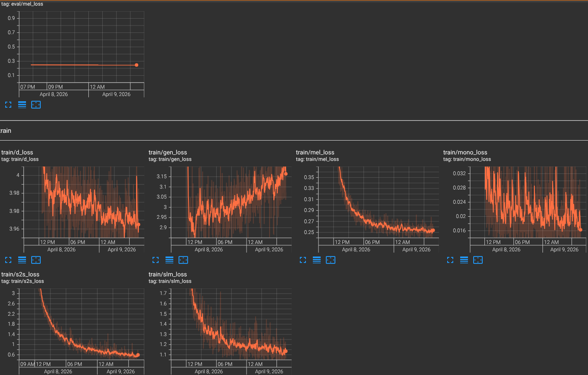

# kokoro-deutsch

Fine-tuning [Kokoro-82M](https://github.com/hexgrad/kokoro) for German text-to-speech using [StyleTTS2](https://github.com/yl4579/StyleTTS2).

## Status: Work in Progress

This project provides a complete, documented training recipe for fine-tuning Kokoro-82M on a new language. The end-to-end pipeline has been validated: **Stage 1 training (3/10 epochs) produces intelligible German speech** through the full Kokoro inference pipeline.

Audio quality is rough (robotic prosody, imprecise articulation) as expected at this early stage. The core pipeline is confirmed working:

```
Dataset preparation -> Weight conversion -> Stage 1 training -> Voicepack extraction -> KModel inference
```

### What works

- Dataset preparation pipeline (phonemization, audio conversion, train/val split)
- Weight conversion from Kokoro HuggingFace format to StyleTTS2 checkpoint format
- Stage 1 training (decoder + alignment) producing intelligible speech
- Voicepack extraction from trained checkpoints
- Full inference through Kokoro's `KModel` / `KPipeline`

### Known issues

- **Stage 2 `style_encoder` degradation**: Stage 2 training collapses the style encoder when `joint_epoch` is set high (disabling GAN/SLM losses). Workaround: extract voicepack using Stage 1 style encoder weights. See the [Training Guide](docs/TRAINING_GUIDE.md#critical-finding-stage-2-style-encoder-degradation) for details.
- Only 3/10 Stage 1 epochs completed so far — articulation quality will improve with more training.
- Stage 2 prosody predictor needs investigation with `joint_epoch` enabled.

### Training progress

| Stage | Epochs | Status | Audio quality |
|-------|--------|--------|---------------|
| Stage 1 (decoder) | 3/10 | Paused | Intelligible but robotic |
| Stage 2 (prosody) | 2/10 | Blocked | Static noise (style encoder collapse) |

Stage 1 TensorBoard loss curves:



## Dataset

The initial training used 11,551 clips (28.6 hours) of German speech. This dataset is **not included** in the repository and cannot be redistributed.

To reproduce, you can use any clean German speech dataset. Recommended open alternatives:

| Dataset | Hours | Speakers | License |
|---------|-------|----------|---------|
| [Thorsten-Voice](https://www.thorsten-voice.de/en/datasets-2/) | ~23h | 1 (male) | CC0 |
| [HUI-Audio-Corpus-German](https://opendata.iisys.de/dataset/hui-audio-corpus-german/) | ~200h | 5+ | Public Domain |
| [CSS10 German](https://github.com/Kyubyong/css10) | ~17h | 1 (female) | Public Domain |

See the [Training Guide - Dataset Preparation](docs/TRAINING_GUIDE.md#step-1-dataset-preparation) for format requirements.

## Quick Start

### Prerequisites

```bash
# System dependency (required for German G2P)
# Ubuntu/Debian:
sudo apt-get install espeak-ng

# macOS:
brew install espeak-ng
```

### Setup

```bash
git clone --recurse-submodules https://github.com/semidark/kokoro-deutsch
cd kokoro-deutsch

# Install Python dependencies
uv sync
```

### Training

The full training process is documented in **[docs/TRAINING_GUIDE.md](docs/TRAINING_GUIDE.md)**, covering:

1. Dataset preparation (audio format, IPA phonemization, train/val split)
2. Weight conversion (Kokoro HuggingFace -> StyleTTS2 format)
3. Symbol mapping (critical: Kokoro vs StyleTTS2 token indices)
4. `weight_norm` API migration (critical: old vs new PyTorch API)
5. Stage 1 training (decoder + alignment)
6. Stage 2 training (prosody predictor) and known pitfalls
7. Voicepack extraction
8. AMD ROCm-specific notes

### Inference (once trained)

```bash
uv run kokoro --text "Hallo Welt" -o output.wav -l d --voice dm_daniel
```

## Repository Structure

```
kokoro/              # Kokoro TTS inference package (from hexgrad/kokoro, lightly modified)
kokoro.js/           # Kokoro JS/TS package (from hexgrad/kokoro, unmodified)
StyleTTS2/           # Training code (git submodule from semidark/StyleTTS2, main branch)
scripts/             # Original: dataset prep, voicepack extraction, inference testing
configs/             # Original: training configuration
docs/                # Original: training guide and documentation
training/            # Training data lists and config (audio files excluded)
demo/                # Gradio web demo (from hexgrad/kokoro, unmodified)
examples/            # Usage examples (from hexgrad/kokoro, unmodified)
tests/               # Unit tests (from hexgrad/kokoro, unmodified)
```

See [NOTICE](NOTICE) for full attribution of all upstream code.

## Contributing

This project exists because training a German voice for Kokoro turned out to be much harder than expected, and the training recipe didn't exist anywhere. If you have ML/TTS experience and want to help, contributions are welcome — especially on:

- Diagnosing and fixing the Stage 2 `style_encoder` degradation
- Investigating `joint_epoch` and GAN/SLM adversarial training settings
- Training with open datasets (Thorsten-Voice, HUI-Audio-Corpus)
- Multi-speaker support

See the [GitHub Issues](https://github.com/semidark/kokoro-deutsch/issues) for the current discussion.

## Acknowledgements

- [hexgrad](https://github.com/hexgrad) for [Kokoro](https://github.com/hexgrad/kokoro) and [misaki](https://github.com/hexgrad/misaki)
- [yl4579](https://github.com/yl4579) for [StyleTTS 2](https://github.com/yl4579/StyleTTS2)
- [dida-80b](https://github.com/dida-80b) for debugging insights on `style_encoder` loading and `joint_epoch` behavior

## License

Apache License 2.0 — see [LICENSE](LICENSE).
